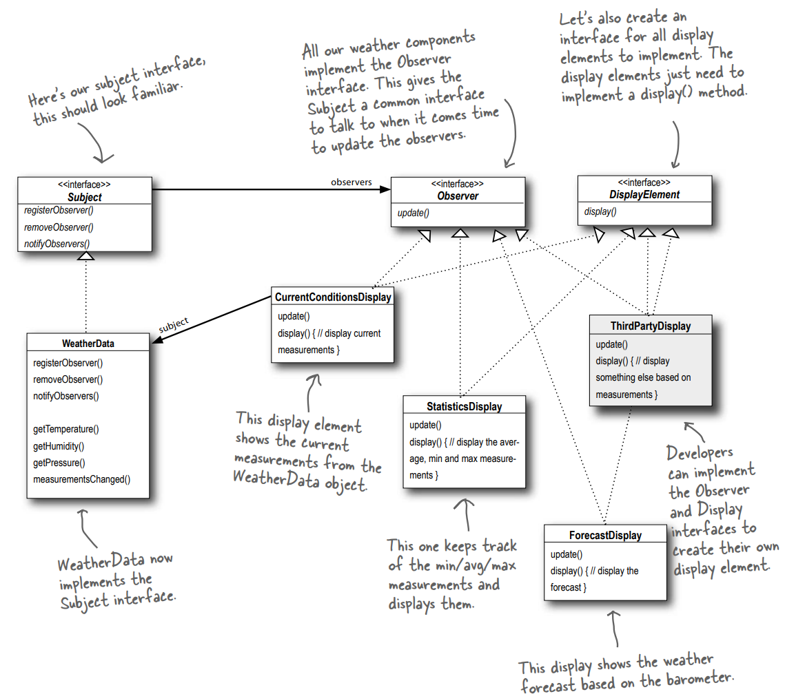

# I. Design Patterns
## 1. Creational Patterns
### Factory method
**Factory method** - defines an interface for creating an object, but lets subclasses decide which class to instantiate. Factory Method lets a class defer instantiation to subclasses.

### Abstract factory
**Abstract factory** - provides an interface for creating families of related or dependent objects without specifying their concrete classes.

## 2. Structural
### Decorator
**Decorator** - attaches additional responsibilities to an object dynamically. Decorators provide a flexible alternative to subclassing for extending functionality.

### Adapter
**Adapter** - converts the interface of a class into another interface the client expect. Adapter lets classes work together that coun't otherwise because of incompatible interfaces.
Object adateprs and class adapters (composition vs ingeritance). Here is the Object Adapter UML:

### Facade
**Facade** - provide a unified interface to a set of interfaces in a subsytem. Facade defines a higher-level interface that makes the subsystem easier to use.
Object adateprs and class adapters (composition vs ingeritance). Here is the Object Adapter UML:

**The Principle of Least Knowledge** talk only to your immediate friends.

## 3. Behavioral
### Strategy
**Strategy** - defines a family of algorithms, encapsulates each one, and makes them interchangeable. Strategy lets the algorithm vary independently from clients that use it.

### Observer
**Observer** - defines a one-to-many dependency between objects so that when one object changes state, all its dependents are notified and updated automatically.

### Command
**Command** - encapsulates a request as an object, thereby letting you parameterize clients with different requests, queue or log requests, and support undoable operations.

### Template Method
**Template method** - defines the skeleton of an algorithm in a method, deferring some steps to subclasses. Template method lets subclasses redefine certain steps of an algorithm without changing the algorithm's structure.

### Iterator
**Iterator** - provides a way to access the elements of an aggregate object sequentially without exposing its underlying representation.

# II. SOLID
 ## 1. Single Responsibility
 - Decorator
 - Factory Method
 - Abstract Factory
 - Command
 - Adapter
 ## 2. Open for Extension / Closed for Modification
 - Strategy
 - Observer
 - Decorator
 - Factory Method
 - Abstract Factory
 - Command
 - Adapter
 ## 3. Liskov Substitution
 ## 4. Interface Segregation
 ## 5. Dependency Inversion

# III. OO Principles
- Encapsulate what varies
- Favor composition over inheritence
- Program to interfaces, not implementations
- Strive for loosely coupled designs between objects that interact
- Classes should be open for extension but closed for modification
- Depend on abstractions. Do not depend on concrete classes
- Only talk to your friends (The Principle of Least Knowledge)
- Don't call us, we'll call you (Hollywood Principle)
- A class should have only one reason to change